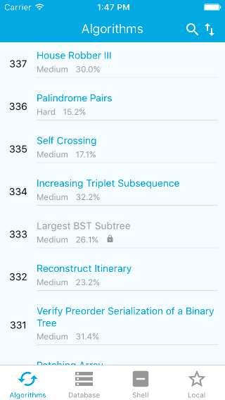
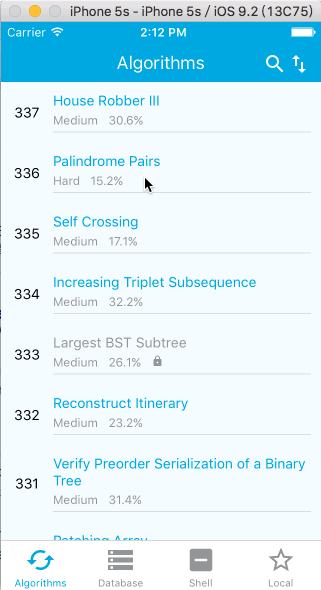
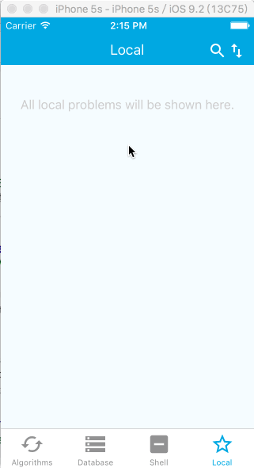

# React Native LeetCode Reader

Read LeetCode problems in your iOS devices and save them at local.

## Preview

__Read Problems__



__Filters__



__Save at Local__



## Setup

Clone this repo and run:

```
npm install
```

## Run

Open `leetcode.xcodeproj` in `XCode` and run.
