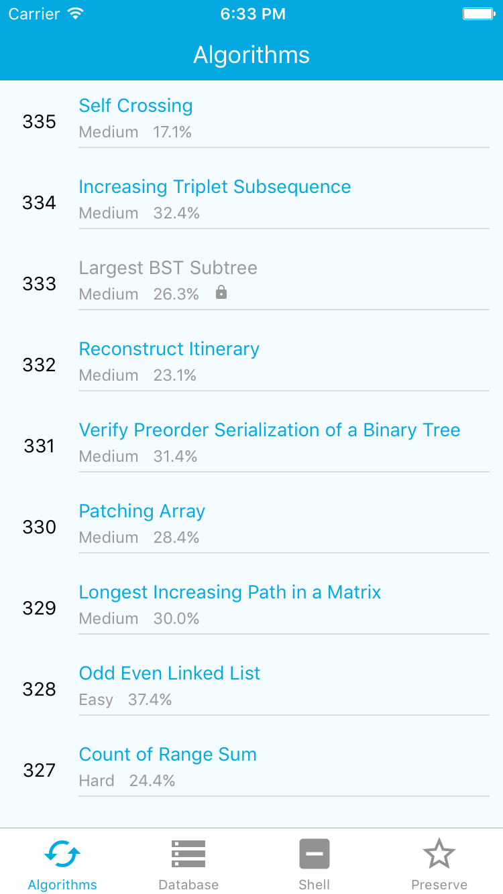
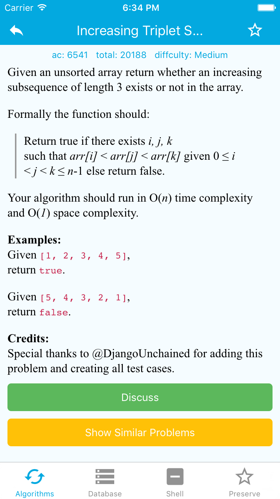
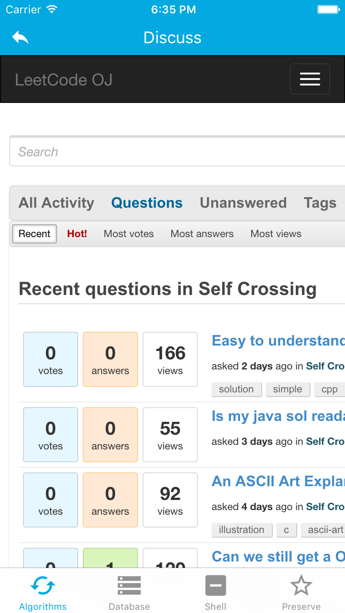
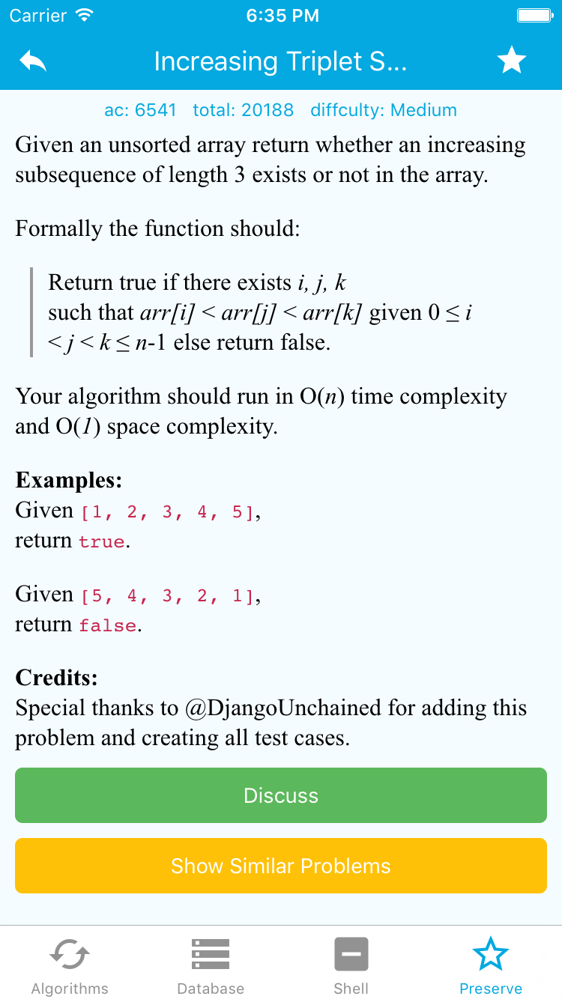

# React Native LeetCode Reader

Read LeetCode problems in your iOS devices and save them at local.

## Preview

__Problem List__


__Problem Detail__


__Discuss (simply WebView)__


__Reading Offline__


## Setup

Clone this repo and run:

```
npm install
```
